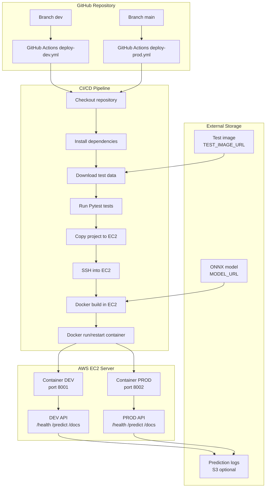

# ONNX Automatic Deployment API — Sistema de despliegue automático de modelos ONNX

## Descripción general

Este proyecto implementa un sistema de despliegue automático para un modelo de clasificación de imágenes en formato **ONNX**, usando **FastAPI**, **ONNX Runtime**, **Docker**, **GitHub Actions**, **AWS EC2** y almacenamiento externo para el modelo y los archivos de prueba.

El objetivo principal es automatizar el proceso mediante el cual una nueva versión del código puede ser validada, empaquetada y desplegada en un servidor cloud, exponiendo endpoints independientes para los ambientes de desarrollo y producción.

El modelo ONNX **no se almacena dentro del repositorio**. Se descarga desde una fuente externa definida mediante variables de entorno, por ejemplo un bucket de AWS S3 o una URL HTTP(S). Esto permite mantener el repositorio liviano, evitar versionar archivos pesados y cumplir con el requerimiento de separar el código fuente de los artefactos de modelo.

---

## Tabla de contenidos

1. [Definición del problema](#1-definición-del-problema)
2. [Arquitectura general de la solución](#2-arquitectura-general-de-la-solución)
3. [GitHub y estrategia de ramas](#3-github-y-estrategia-de-ramas)
4. [GitHub Actions y automatización CI/CD](#4-github-actions-y-automatización-cicd)
5. [Modelo ONNX y almacenamiento externo](#5-modelo-onnx-y-almacenamiento-externo)
6. [Datos de prueba y validación automática](#6-datos-de-prueba-y-validación-automática)
7. [API de predicción con FastAPI](#7-api-de-predicción-con-fastapi)
8. [Docker y despliegue en AWS EC2](#8-docker-y-despliegue-en-aws-ec2)
9. [Persistencia de predicciones](#9-persistencia-de-predicciones)
10. [Estructura del repositorio](#10-estructura-del-repositorio)
11. [Variables de entorno y secretos](#11-variables-de-entorno-y-secretos)
12. [Cómo ejecutar el sistema localmente](#12-cómo-ejecutar-el-sistema-localmente)
13. [Cómo ejecutar el sistema con Docker](#13-cómo-ejecutar-el-sistema-con-docker)
14. [Flujo de despliegue en DEV y PROD](#14-flujo-de-despliegue-en-dev-y-prod)
15. [Viabilidad de la solución](#15-viabilidad-de-la-solución)
16. [Supuestos y restricciones](#16-supuestos-y-restricciones)

---

## 1. Definición del problema

El problema consiste en construir una solución que permita desplegar automáticamente un modelo de machine learning en formato **ONNX** para que pueda ser consumido mediante una API.

En este caso, el modelo usado es un clasificador de imágenes basado en **ResNet-50**, entrenado sobre clases de ImageNet. La aplicación recibe una imagen, la transforma al formato esperado por el modelo, ejecuta inferencia con ONNX Runtime y devuelve la clase predicha junto con un valor de confianza.

### Tipo de problema

```text
Clasificación supervisada multiclase de imágenes
```

### Entrada del sistema

```text
Imagen cargada por el usuario mediante HTTP POST
Formato soportado: JPG, JPEG, PNG u otros formatos compatibles con PIL
```

### Salida del sistema

```json
{
  "filename": "image.jpg",
  "prediction": {
    "predicted_class_name": "German shepherd",
    "confidence": 0.91
  }
}
```

### Objetivo técnico

Automatizar el ciclo:

```text
Código en GitHub
      ↓
Validación con pruebas automáticas
      ↓
Construcción de imagen Docker
      ↓
Despliegue automático en AWS EC2
      ↓
Exposición de endpoints DEV y PROD
```

---

## 2. Arquitectura general de la solución



### Resumen de ambientes

| Ambiente | Rama | Workflow | Puerto | Endpoint esperado |
|---|---|---|---:|---|
| Desarrollo | `dev` | `.github/workflows/deploy-dev.yml` | `8001` | `http://EC2_PUBLIC_IP:8001` |
| Producción | `main` | `.github/workflows/deploy-prod.yml` | `8002` | `http://EC2_PUBLIC_IP:8002` |

---

## 3. GitHub y estrategia de ramas

### Tecnología elegida

Se usa **GitHub** para versionamiento del código y **GitHub Actions** para automatizar el proceso de validación y despliegue.

### Justificación

| Alternativa considerada | Razón de descarte |
|---|---|
| Jenkins | Requiere servidor adicional, configuración manual y mayor mantenimiento |
| GitLab CI | Es una buena alternativa, pero el proyecto ya se encuentra orientado a GitHub |
| Despliegue manual por SSH | No cumple adecuadamente el objetivo de automatización del ciclo de despliegue |

GitHub Actions se eligió porque permite definir el pipeline como código dentro del mismo repositorio, usando archivos YAML versionados en `.github/workflows`.

### Estrategia de ramas

```text
main  → rama productiva protegida. Despliega el contenedor PROD.
dev   → rama de desarrollo/integración. Despliega el contenedor DEV.
```

### Flujo de trabajo esperado

```text
1. Los cambios se desarrollan inicialmente en dev.
2. Cada push a dev ejecuta pruebas y despliega el ambiente DEV.
3. Cuando la versión está validada, se crea un Pull Request hacia main.
4. main debe estar protegida para evitar cambios directos.
5. Al aprobar y fusionar el Pull Request, GitHub Actions despliega PROD.
```

---

## 4. GitHub Actions y automatización CI/CD

El proyecto incluye dos workflows de despliegue:

```text
.github/workflows/deploy-dev.yml
.github/workflows/deploy-prod.yml
```

### Pipeline para DEV

El workflow `deploy-dev.yml` se ejecuta cuando hay un push a la rama `dev`.

Pasos principales:

```text
1. Checkout del repositorio.
2. Configuración de Python 3.11.
3. Instalación de dependencias desde requirements.txt.
4. Descarga de datos de prueba desde TEST_IMAGE_URL.
5. Ejecución de pruebas con Pytest.
6. Copia del proyecto al servidor EC2.
7. Conexión por SSH al EC2.
8. Construcción de la imagen Docker dentro del EC2.
9. Detención y eliminación del contenedor anterior.
10. Ejecución del nuevo contenedor en el puerto 8001.
```

### Pipeline para PROD

El workflow `deploy-prod.yml` se ejecuta cuando hay un push o merge a la rama `main`.

Pasos principales:

```text
1. Checkout del repositorio.
2. Configuración de Python 3.11.
3. Instalación de dependencias.
4. Descarga de imagen de prueba.
5. Ejecución de pruebas automáticas.
6. Copia del proyecto al EC2.
7. Construcción de Docker dentro del EC2.
8. Reinicio del contenedor productivo en el puerto 8002.
```

### Importante

La imagen Docker se construye directamente en el servidor EC2 mediante este flujo:

```text
GitHub Actions
      ↓
scp-action copia el proyecto al EC2
      ↓
ssh-action ejecuta comandos remotos
      ↓
docker build -t onnx-api-dev .
docker run -d -p 8001:8000 ...
```

Esto evita tener que usar Docker Hub, Amazon ECR o ECS/Fargate para esta entrega académica.

---

## 5. Modelo ONNX y almacenamiento externo

### Tecnología elegida

Se usa **ONNX Runtime** para ejecutar inferencias sobre un modelo en formato `.onnx`.

### Justificación de ONNX

| Criterio | Justificación |
|---|---|
| Portabilidad | ONNX permite ejecutar modelos entrenados en distintos frameworks |
| Estandarización | Es un formato ampliamente usado para intercambio de modelos |
| Eficiencia | ONNX Runtime está optimizado para inferencia |
| Ligereza | Permite servir el modelo desde una API sin cargar frameworks pesados de entrenamiento |

### Descarga del modelo

El modelo no se almacena dentro del repositorio. La aplicación lo descarga cuando no existe localmente en la ruta definida por `MODEL_PATH`.

Variables principales:

```text
MODEL_URL   → ubicación externa del modelo ONNX
MODEL_PATH  → ruta local donde se guarda el modelo descargado
```

El código soporta URLs de tipo:

```text
https://...
s3://bucket/key
```

### Comportamiento esperado

```text
1. La API inicia.
2. Se verifica si existe models/resnet50.onnx.
3. Si no existe, se descarga desde MODEL_URL.
4. Si la descarga falla, el servicio genera un error explícito.
5. Si la descarga es correcta, ONNX Runtime carga el modelo en memoria.
```

---

## 6. Datos de prueba y validación automática

El proyecto incluye un script para descargar una imagen de prueba desde almacenamiento externo:

```text
scripts/download_test_data.py
```

La imagen de prueba se descarga a:

```text
data/test/test_img.jpg
```

### Variables usadas

```text
TEST_IMAGE_URL   → URL externa de la imagen de prueba
TEST_IMAGE_PATH  → ruta local donde se descarga la imagen
```

### Pruebas implementadas

El repositorio incluye pruebas automáticas en la carpeta `tests/`:

```text
tests/test_model_load.py
tests/test_prediction_metric.py
```

### Qué validan las pruebas

| Prueba | Validación |
|---|---|
| `test_model_load.py` | Verifica que el modelo ONNX se cargue correctamente y tenga entradas/salidas |
| `test_prediction_metric.py` | Verifica que exista una imagen de prueba, que el modelo responda y que la confianza supere el umbral configurado |

### Umbral de confianza

La variable:

```text
MIN_CONFIDENCE=0.80
```

permite exigir que la predicción de la imagen de prueba tenga una confianza mínima del 80%.

Además, el proyecto permite validar clases esperadas mediante:

```text
EXPECTED_CLASS_IDS=235
```

> Nota: el valor `235` corresponde al caso configurado para la imagen de prueba usada en el proyecto. Si se cambia la imagen de prueba, se debe actualizar este valor.

---

## 7. API de predicción con FastAPI

### Tecnología elegida

**FastAPI** se usa para exponer el modelo mediante endpoints REST.

### Justificación

| Alternativa considerada | Razón de descarte |
|---|---|
| Flask | Requiere más configuración para documentación automática |
| Django REST Framework | Es excesivo para un microservicio simple de inferencia |
| Streamlit | Está más orientado a interfaces visuales que a servicios REST |

FastAPI permite exponer una API liviana, generar documentación interactiva automática en `/docs` y recibir archivos mediante `multipart/form-data`.

### Endpoints disponibles

| Endpoint | Método | Descripción |
|---|---|---|
| `/` | GET | Retorna información básica del servicio |
| `/health` | GET | Verifica que la API esté activa y que el modelo cargue correctamente |
| `/predict` | POST | Recibe una imagen, ejecuta la inferencia y devuelve la predicción |
| `/docs` | GET | Interfaz Swagger UI generada automáticamente por FastAPI |

### Ejemplo de respuesta de `/health`

```json
{
  "status": "ok",
  "model_loaded": true,
  "inputs": ["input"],
  "outputs": ["output"]
}
```

### Ejemplo de respuesta de `/predict`

```json
{
  "filename": "test_img.jpg",
  "prediction": {
    "predicted_class_name": "German shepherd",
    "confidence": 0.91
  }
}
```

---

## 8. Docker y despliegue en AWS EC2

### Tecnología elegida

El proyecto usa **Docker** para empaquetar la API y **AWS EC2** como servidor cloud donde se ejecutan los contenedores.

### Justificación de Docker

| Alternativa considerada | Razón de descarte |
|---|---|
| Ejecutar Python directamente en el servidor | Puede generar diferencias de entorno entre local, GitHub Actions y EC2 |
| Entorno virtual manual | Requiere más pasos operativos y es más propenso a errores |
| Docker | Permite reproducibilidad, portabilidad y despliegue consistente |

### Justificación de AWS EC2

| Alternativa considerada | Razón de descarte |
|---|---|
| ECS/Fargate | Puede generar costos adicionales y requiere más configuración |
| Elastic Beanstalk | Agrega abstracción innecesaria para esta entrega |
| Lambda | No es ideal para modelos grandes ni APIs con contenedores persistentes |
| EC2 con Docker | Es simple, controlable y suficiente para exponer DEV y PROD |

### Contenedores esperados

```text
onnx-api-dev   → expuesto en puerto 8001
onnx-api-prod  → expuesto en puerto 8002
```

### Docker Compose local

El archivo `docker-compose.yml` permite levantar ambos ambientes localmente:

```text
onnx-api-dev   → http://localhost:8001
onnx-api-prod  → http://localhost:8002
```

---

## 9. Persistencia de predicciones

Cada vez que se realiza una predicción, la aplicación registra el resultado en un archivo de texto.

### Archivo local

```text
predictions_dev.txt
predictions_prod.txt
```

Cada línea incluye:

```text
timestamp | resultado en formato JSON
```

### Sincronización opcional con S3

El proyecto incluye soporte opcional para subir el log a S3 mediante:

```text
PREDICTION_BUCKET
PREDICTION_BUCKET_KEY
```

Esto permite mantener las predicciones fuera del contenedor y conservarlas incluso después de un redeploy.

### Comportamiento implementado

```text
1. Al iniciar la API, intenta restaurar el log desde S3 si está configurado.
2. Al ejecutar una predicción, guarda el resultado en un TXT local.
3. Si hay bucket configurado, sincroniza el archivo TXT hacia S3.
```

---

## 10. Estructura del repositorio

```text
onnx-auto-deployment-main/
│
├── README.md
├── Dockerfile
├── docker-compose.yml
├── requirements.txt
├── .env.example
├── .gitignore
│
├── app/
│   ├── __init__.py
│   ├── config.py                 ← variables de configuración
│   ├── imagenet_classes.txt      ← nombres de clases ImageNet
│   ├── main.py                   ← entrypoint FastAPI
│   ├── model.py                  ← descarga/carga del modelo e inferencia
│   ├── preprocessing.py          ← transformación de imagen a tensor
│   └── utils.py                  ← logging local y sincronización con S3
│
├── scripts/
│   ├── download_model.py         ← descarga manual del modelo
│   ├── download_test_data.py     ← descarga imagen de prueba
│   ├── smoke_test_endpoint.py    ← prueba rápida del endpoint desplegado
│   └── upload_prediction_log.py  ← subida manual del log a S3
│
├── tests/
│   ├── test_model_load.py        ← prueba de carga del modelo
│   └── test_prediction_metric.py ← prueba de predicción y umbral
│
└── .github/
    └── workflows/
        ├── deploy-dev.yml        ← despliegue automático DEV
        └── deploy-prod.yml       ← despliegue automático PROD
```

---

## 11. Variables de entorno y secretos

El archivo `.env.example` documenta las variables necesarias para ejecutar el proyecto.

### Variables principales

| Variable | Descripción |
|---|---|
| `APP_ENV` | Ambiente de ejecución: `local`, `dev` o `prod` |
| `MODEL_URL` | URL externa del modelo ONNX |
| `MODEL_PATH` | Ruta local donde se guarda el modelo |
| `TEST_MODEL` | Modelo usado durante la etapa de pruebas |
| `TEST_IMAGE_URL` | URL externa de la imagen de prueba |
| `TEST_IMAGE_PATH` | Ruta local de la imagen descargada |
| `PREDICTION_LOG_PATH` | Archivo TXT donde se registran predicciones |
| `PREDICTION_BUCKET` | Bucket S3 opcional para guardar logs |
| `PREDICTION_BUCKET_KEY` | Ruta del TXT dentro del bucket |
| `MIN_CONFIDENCE` | Umbral mínimo de confianza para pruebas |
| `EXPECTED_CLASS_IDS` | ID esperado de la clase para la imagen de prueba |

### GitHub Secrets requeridos

En GitHub se deben configurar los siguientes secrets:

```text
EC2_HOST
EC2_USER
EC2_SSH_KEY
MODEL_URL
TEST_MODEL
TEST_IMAGE_URL
PREDICTION_BUCKET
AWS_ACCESS_KEY_ID
AWS_SECRET_ACCESS_KEY
AWS_DEFAULT_REGION
```

### Ruta en GitHub

```text
Repository → Settings → Secrets and variables → Actions → New repository secret
```

> Importante: nunca se deben subir credenciales de AWS, llaves privadas `.pem`, archivos `.env` reales ni modelos pesados al repositorio.

---

## 12. Cómo ejecutar el sistema localmente

### Requisitos previos

```text
Python 3.11+
Git
Modelo ONNX disponible mediante MODEL_URL o en MODEL_PATH
Imagen de prueba disponible mediante TEST_IMAGE_URL
```

### Pasos

```bash
# 1. Clonar el repositorio
git clone <url-del-repositorio>
cd onnx-auto-deployment-main

# 2. Crear entorno virtual
python -m venv .venv

# 3. Activar entorno virtual
# Linux/Mac
source .venv/bin/activate

# Windows PowerShell
.venv\Scripts\Activate.ps1

# 4. Instalar dependencias
pip install -r requirements.txt

# 5. Configurar variables de entorno
# Linux/Mac
export MODEL_URL="https://your-host/resnet50.onnx"
export TEST_IMAGE_URL="https://your-host/test_img.jpg"

# Windows PowerShell
$env:MODEL_URL="https://your-host/resnet50.onnx"
$env:TEST_IMAGE_URL="https://your-host/test_img.jpg"

# 6. Descargar imagen de prueba
python scripts/download_test_data.py

# 7. Ejecutar pruebas
pytest tests/

# 8. Levantar la API
uvicorn app.main:app --reload
```

### Servicios disponibles localmente

```text
http://localhost:8000        → API
http://localhost:8000/docs   → Swagger UI
http://localhost:8000/health → Health check
```

### Ejemplo de predicción

```bash
curl -X POST http://localhost:8000/predict \
  -F "file=@data/test/test_img.jpg"
```

---

## 13. Cómo ejecutar el sistema con Docker

### Construir imagen

```bash
docker build -t onnx-api .
```

### Ejecutar contenedor

```bash
docker run -d \
  --name onnx-api \
  -p 8000:8000 \
  -e MODEL_URL="https://your-host/resnet50.onnx" \
  onnx-api
```

### Ejecutar con Docker Compose

```bash
docker compose up --build
```

Esto levanta:

```text
DEV  → http://localhost:8001
PROD → http://localhost:8002
```

### Probar endpoint DEV local

```bash
curl http://localhost:8001/health

curl -X POST http://localhost:8001/predict \
  -F "file=@data/test/test_img.jpg"
```

### Probar endpoint PROD local

```bash
curl http://localhost:8002/health

curl -X POST http://localhost:8002/predict \
  -F "file=@data/test/test_img.jpg"
```

---

## 14. Flujo de despliegue en DEV y PROD

### Despliegue DEV

```bash
git checkout dev
git add .
git commit -m "Update dev version"
git push origin dev
```

Resultado esperado:

```text
1. GitHub Actions ejecuta deploy-dev.yml.
2. Se instalan dependencias.
3. Se descarga la imagen de prueba.
4. Se ejecutan pruebas.
5. Se copia el proyecto a ~/onnx-auto-deployment-dev en EC2.
6. Se construye la imagen Docker en EC2.
7. Se reinicia el contenedor onnx-api-dev.
8. La API queda disponible en http://EC2_PUBLIC_IP:8001.
```

### Despliegue PROD

El despliegue productivo debe hacerse mediante Pull Request hacia `main`.

```text
dev → Pull Request → main
```

Cuando el Pull Request se aprueba y se fusiona:

```text
1. GitHub Actions ejecuta deploy-prod.yml.
2. Se validan pruebas.
3. Se copia el proyecto a ~/onnx-auto-deployment-prod en EC2.
4. Se construye la imagen Docker en EC2.
5. Se reinicia el contenedor onnx-api-prod.
6. La API queda disponible en http://EC2_PUBLIC_IP:8002.
```

### Verificar contenedores en EC2

```bash
docker ps
```

Resultado esperado:

```text
onnx-api-dev    0.0.0.0:8001->8000
onnx-api-prod   0.0.0.0:8002->8000
```

---

## 15. Viabilidad de la solución

La solución es viable para el problema propuesto porque utiliza componentes simples, disponibles y ampliamente usados en proyectos de despliegue de modelos.

### Elementos que soportan la viabilidad

| Elemento | Justificación |
|---|---|
| FastAPI | Permite exponer el modelo como una API REST simple y documentada |
| ONNX Runtime | Ejecuta modelos ONNX de forma eficiente sin necesidad de frameworks de entrenamiento |
| Docker | Garantiza que la aplicación corra igual en local, GitHub Actions y EC2 |
| GitHub Actions | Automatiza pruebas, copia de archivos y despliegue |
| AWS EC2 | Permite alojar dos contenedores en una sola instancia para DEV y PROD |
| S3 opcional | Permite almacenar modelo, imagen de prueba y logs fuera del repositorio |
| Pytest | Permite validar carga del modelo y calidad mínima de predicción |

### Por qué no se usa Fargate

Fargate puede simplificar la administración de servidores, pero para esta entrega implica más configuración y puede generar costos adicionales por CPU, memoria y tiempo de ejecución. Para un proyecto académico, EC2 con Docker es más directo, controlable y suficiente.

### Riesgos y mitigaciones

| Riesgo | Mitigación |
|---|---|
| Modelo muy pesado | Se mantiene fuera del repositorio y se descarga bajo demanda |
| Cambio de imagen de prueba | Actualizar `EXPECTED_CLASS_IDS` y `MIN_CONFIDENCE` |
| Falla de credenciales AWS | Usar GitHub Secrets y no subir credenciales al repositorio |
| Pérdida de logs al redeploy | Sincronización opcional con S3 |
| Push directo a producción | Protección de rama `main` |

---

## 16. Supuestos y restricciones

```text
1. El modelo usado es ResNet-50 en formato ONNX.
2. El modelo se descarga desde almacenamiento externo usando MODEL_URL.
3. La imagen de prueba también se descarga desde almacenamiento externo.
4. La instancia EC2 tiene Docker instalado y puertos 8001/8002 abiertos.
5. Las credenciales AWS se configuran como GitHub Secrets.
6. El despliegue productivo ocurre desde la rama main.
7. La rama main debe protegerse manualmente desde GitHub.
8. La solución no usa Fargate para evitar costos y complejidad adicional.
9. La API no implementa autenticación porque es una entrega académica.
10. La persistencia de logs en S3 es opcional y depende de configurar PREDICTION_BUCKET.
```

---
